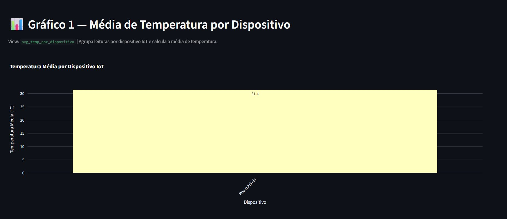
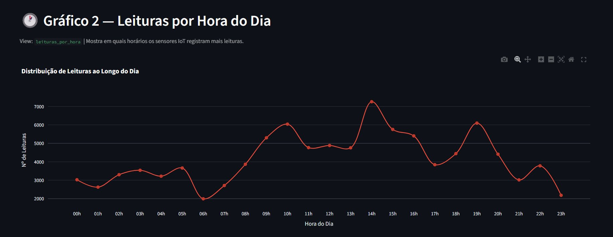
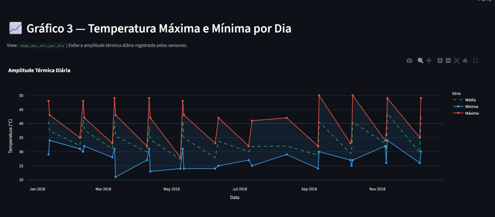

# 🌡️ Pipeline de Dados com IoT e Docker

**Disciplina:** Disruptive Architectures: IoT, Big Data e IA
**Instituição:** UNIFECAF
**Autora:** Lais Goncalves Mendes | RA: 51212
**Ano:** 2026

---

## 📌 Sobre o Projeto

Pipeline de dados completo para processamento de leituras de temperatura de sensores IoT.
Os dados são obtidos do dataset público do Kaggle, processados com Python/Pandas,
armazenados em PostgreSQL via Docker e visualizados em dashboard interativo com Streamlit.

---

## 🛠️ Tecnologias

| Tecnologia       | Função                              |
|------------------|-------------------------------------|
| Python 3.11+     | Orquestração e ETL                  |
| Docker           | Containerização do PostgreSQL       |
| PostgreSQL       | Armazenamento relacional            |
| SQLAlchemy       | Conexão Python → PostgreSQL         |
| Pandas           | Limpeza e transformação dos dados   |
| Streamlit        | Dashboard web interativo            |
| Plotly           | Gráficos interativos                |

---

## 📁 Estrutura do Projeto

```
pipeline-iot/
├── src/
│   ├── load_data.py      # ETL: CSV → PostgreSQL
│   └── dashboard.py      # Dashboard Streamlit
├── data/
│   └── IOT-temp.csv      # Dataset Kaggle (baixar manualmente)
├── docs/
│   └── views.sql         # Documentação das 3 views SQL
├── .env                  # Credenciais (não commitar!)
├── .gitignore
├── requirements.txt
└── README.md
```

---

## ⚙️ Pré-requisitos

- Python 3.11+
- Docker Desktop
- Git

---

## 🚀 Passo a Passo

### 1. Clone o repositório
```bash
git clone https://github.com/lais14mendes/pipeline-iot-docker-LM-RF-51212.git
cd pipeline-iot-docker-LM-RF-51212
```

### 2. Baixe o dataset
Acesse: https://www.kaggle.com/datasets/atulanandjha/temperature-readings-iot-devices
Salve o arquivo `IOT-temp.csv` na pasta `/data`.

### 3. Crie o ambiente virtual
```bash
python -m venv venv
# Windows:
venv\Scripts\activate
# Linux/Mac:
source venv/bin/activate
```

### 4. Instale as dependências
```bash
pip install -r requirements.txt
```

### 5. Configure o arquivo .env
Edite o arquivo `.env` na raiz com suas credenciais (padrão já configurado).

### 6. Suba o container PostgreSQL
```bash
docker run --name postgres-iot
-e POSTGRES_PASSWORD=iot1234
-e POSTGRES_DB=iot_pipeline
-p 5432:5432 -d postgres
```

### 7. Execute o pipeline de ingestão
```bash
python src/load_data.py
```

### 8. Execute o dashboard
```bash
streamlit run src/dashboard.py
```
Acesse: http://localhost:8501

---

## 🗄️ Views SQL

| View | Descrição |
|------|-----------|
| `avg_temp_por_dispositivo` | Temperatura média por sensor IoT |
| `leituras_por_hora`        | Distribuição de leituras por hora do dia |
| `temp_max_min_por_dia`     | Amplitude térmica diária (máx/min/média) |

> As views são criadas automaticamente pelo `load_data.py`.
> O arquivo `docs/views.sql` serve como documentação e versionamento.

---

## 📊 Dataset

- **Fonte:** Kaggle — Temperature Readings: IoT Devices
- **Link:** https://www.kaggle.com/datasets/atulanandjha/temperature-readings-iot-devices
- **Registros brutos:** ~97.606
- **Válidos após limpeza:** ~49.944
- **Colunas:** id, room_id/id, noted_date, temp, out/in

---

## 📝 Limpeza de Dados

O pipeline aplica as seguintes etapas de limpeza:
1. Remoção de registros com valores nulos em campos obrigatórios
2. Remoção de outliers de temperatura (fora do intervalo 0°C – 80°C)
3. Validação do campo `location` (apenas "In" ou "Out")
4. Remoção de duplicatas por `device_id + noted_date`
5. Log completo com relatório de limpeza salvo em `pipeline.log`

---

## 📸 Capturas de Tela do Dashboard

### Gráfico 1 — Temperatura Média por Dispositivo
> View: `avg_temp_por_dispositivo` | Temperatura média do sensor Room Admin: 31,4 °C



---

### Gráfico 2 — Leituras por Hora do Dia
> View: `leituras_por_hora` | Pico de atividade às 14h com ~7.200 leituras



---

### Gráfico 3 — Amplitude Térmica Diária
> View: `temp_max_min_por_dia` | Máxima de 50°C, mínima de 20°C (Jan–Dez 2018)



---

## 🔧 Comandos Git Utilizados

```bash
# Inicializar o repositório local
git init

# Adicionar todos os arquivos ao staging
git add .

# Criar o commit inicial
git commit -m "Projeto inicial: Pipeline de Dados IoT"

# Conectar ao repositório remoto no GitHub
git remote add origin https://github.com/lais14mendes/pipeline-iot-docker-LM-RF-51212.git

# Enviar para o GitHub
git push -u origin main

# Atualizar o repositório local
git pull
```

---

UNIFECAF · 2026

